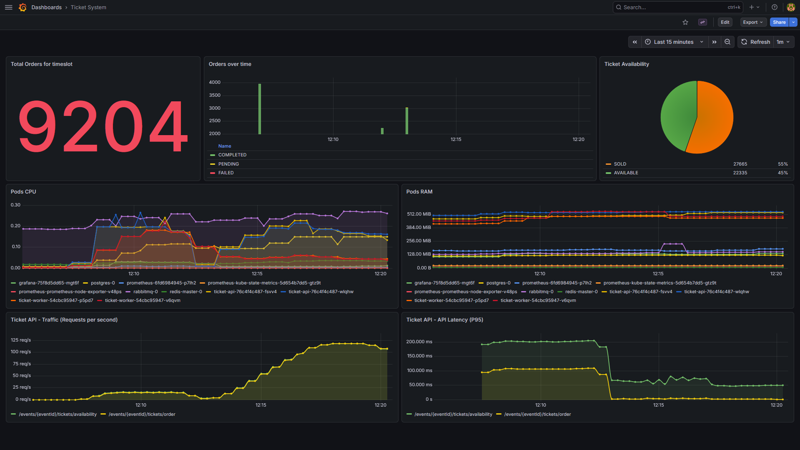

# Scalable Ticket System

This project is a private playground for learning concepts and technologies for high-available distributed systems.

## Learning Goals

Things i wanted to learn and try out in this project:
- Container orchestration with **Kubernetes**
- Caching with **Redis**
- Asynchronous messaging with **RabbitMQ**
- Resilience patterns with **Resilience4j**
- Load testing with **K6**
- Basic Observability with **Prometheus and Grafana**
- Building a multi module project with build tools like **Maven** & defining deployment workflows using a **Taskfile**

## Fictional Use Cases
The project implements a cloud-native ticketing system:

1. **Check ticket availability (High Frequency Read)**
2. **Buy tickets (High Concurrency Write)**




## Infrastructure components

- **Ticket-API (2 Replicas):** Spring Boot Service (REST API) handling HTTP requests. Performs high-speed reads via Redis and publishes write-events to RabbitMQ.
- **Ticket-Worker (2 Replicas):** Spring Boot backend consumer. Asynchronously processes orders, updates the database and invalidates the cache.
- **Ingress:** Ingress Nginx Controller providing a centralized entry point to the Ticket-API and Grafana-Dashboard.
- **Redis:** In-memory store used as a Look-Aside Cache to reduce read-load on the database.
- **PostgreSQL:** Primary relational database for persistent storage of ticket inventory and order transactions.
- **RabbitMQ:** Message broker that buffers high-concurrency write requests.
- **Prometheus:** Scrapes metrics from application endpoints via Spring Boot Actuator.
- **Grafana:** Visualization connected to Prometheus to monitor system health.

## Key Architectural Decisions

- **Command Query Responsibility Segregation (CQRS):** Separation of read operations (API + Cache) and write operations (Worker + DB) to optimize for different load profiles.
- **Resilience & Scalability & Asynchronous Decoupling:** Through replication, load balancing, self-healing, an event-driven architecture with a message queue and Resilience4j (timeouts, circuit breakers, bulkheads).
- **Object-Oriented Programming (OOP) & Domain-Driven Design (DDD):** Implementation of domain-centric logic and OOP principles to ensure high code reusability, modular interchangeability and maintainability.

## Folder Structure

- **backend:** Root folder for Spring Boot services (multi-module project)
  - **ticket-api:** REST API handling HTTP requests.
  - **ticket-worker:** Consumer for asynchronous processing.
  - **ticket-common:** Shared library containing DTOs, Repositories and utilities.
- **k8s:** Kubernetes deployment configurations.
  - **apps:** Manifests for application services.
  - **infrastructure:** Manifests for system infrastructure.

---

## How to start locally:

### Prerequisites 
- **JDK 21** ([Installation](https://www.oracle.com/de/java/technologies/downloads/#java21))
- **Docker** ([Installation](https://www.docker.com/products/docker-desktop/))
- **Kubectl** ([Installation](https://kubernetes.io/docs/tasks/tools/))
- **Minikube** ([Installation](https://minikube.sigs.k8s.io/docs/start/))
- **Helm** ([Installation](https://helm.sh/docs/intro/install/))
- **Task** ([Installation](https://taskfile.dev/docs/installation))
- **K6** ([Installation](https://grafana.com/docs/k6/latest/set-up/install-k6/))

### 1. Environment Setup
Create a `.env` file from the example:
```bash
cp .env.example .env
```
> [!IMPORTANT]
> Change the default secrets in `.env` before any non-local deployment!

### 2. Execution Modes

#### Option A: Local Kubernetes

1.  **Minikube Setup:**
  
    > Docker must be running before starting this step!
    ```bash
    task minikube:setup
    ```
    This will start Minikube with the docker driver, enable the ingress addon, and load the backend images into the cluster.

2.  **Deploy Applications:**
    ```bash
    # Generate K8s secrets, configmap from .env and deploys infrastructure and applications in local kubernetes cluster
    task k8s:deploy
    ```

3.  **Access the Cluster:**
    To access the services via the Ingress (localhost), you must start the Minikube tunnel in a separate terminal:
    ```bash
    task minikube:tunnel
    ```
    **Swagger UI (K8s):** [http://localhost/api/swagger-ui/index.html](http://localhost/api/swagger-ui/index.html) \
    **Grafana (K8s):** [http://localhost/grafana/](http://localhost/grafana/)

4.  **Optional: Run the Load Test**
    Start the load test against the local Kubernetes ingress after the cluster is up and the Minikube tunnel is running:
    ```bash
    task loadtest
    ```
    > If the load test starts failing even though node utilization is still low, the issue may be caused by the local `minikube tunnel` or ingress. \
    > As a comparison test, you can bypass the ingress and tunnel with:
    > ```bash
    > kubectl port-forward svc/ticket-api 8080:8080 -n ticket-system
    > ```
    > Then point the load test (/load-testing/load-test.js) against `http://127.0.0.1:8080/api` instead of `http://localhost/api`.

#### Option B: Local Development (IDE + Docker Single Instance Infrastructure)
1. **Start Infrastructure:** Run `docker-compose up -d` to start Postgres, Redis, and RabbitMQ.
2. **IDE Run-Configuration:**
   - **Active Profile:** Set `spring.profiles.active=dev`.
   - **Environment Variables:** Load variables from `.env` (e.g., using the 'EnvFile' plugin for IntelliJ or launch.json in VS Code).
3. **Build & Run:** 
   ```bash
   task build  # Or: cd backend && ./mvnw clean install
   ```
   Run `TicketApiApplication` or `TicketWorkerApplication` directly from your IDE.

   **Swagger UI (Local):** [http://localhost:8080/api/swagger-ui/index.html](http://localhost:8080/api/swagger-ui/index.html)

## Planned ideas for the future:

- Use Grafana Loki for Logs
- Collect and Visualize Traces with Grafana Alloy
- Auth-Microservice with JWT-Authentication 
- Deploy on Azure with CI/CD Pipeline
- Simple Frontend with React
