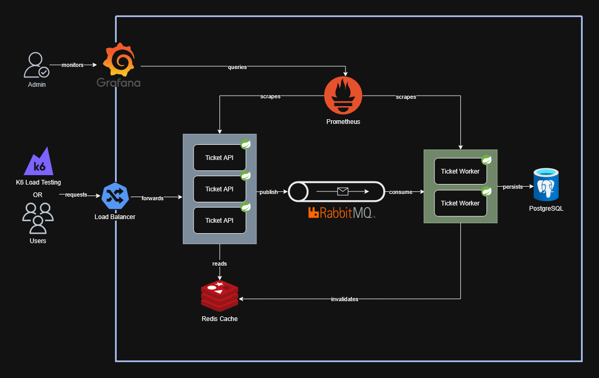

# Scalable Ticket System
This project is a private playground for learning concepts and technologies for high-available distributed systems. It implements a cloud-native ticketing system designed to handle extreme traffic spikes through distributed processing and caching.

## Fictional Use Cases
1. **Check ticket availability (High Frequency Read)**
2. **Buy tickets (High Concurrency Write)**

## Infrastructure components
- **Ticket-API (3 Replicas):** Spring Boot Service (REST API) handling HTTP requests. Performs high-speed reads via Redis and publishes write-events to RabbitMQ.
- **Ticket-Worker (2 Replicas):** Spring Boot backend consumer. Asynchronously processes orders, updates the database and invalidates the cache. 
- **Load Balancer:** Kubernetes Service distributing incoming traffic across API replicas using a Round-Robin strategy.
- **Redis:** In-memory store used as a Look-Aside Cache (TTL: 10s) to reduce read-load on the database.
- **PostgreSQL:** Primary relational database for persistent storage of ticket inventory and order transactions.
- **RabbitMQ:** Message broker that buffers high-concurrency write requests.
- **Prometheus:** Scrapes metrics from application endpoints via Spring Boot Actuator.
- **Grafana:** Visualization layer connected to Prometheus to monitor system health and bottlenecks in real-time.

## Key Architectural Decisions
- **Command Query Responsibility Segregation (CQRS):** Separation of read operations (API + Cache) and write operations (Worker + DB) to optimize for different load profiles.
- **Eventual Consistency:** User requests are acknowledged immediately (HTTP 202), while the actual data consistency is ensured asynchronously by the worker.
- **Resilience & Scalability & Asynchronous Decoupling:** Through replication, load balancing, self-healing (automatic restart of failed pods) and an event driven architecture with a message queue.